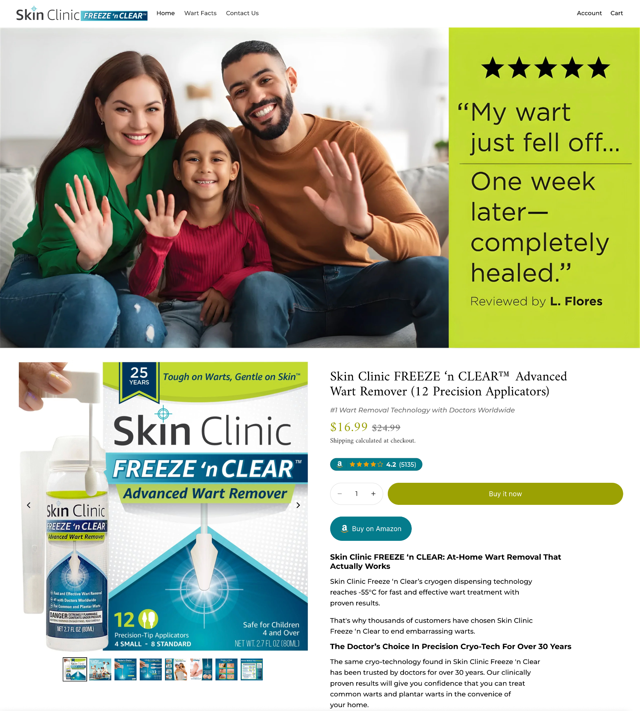
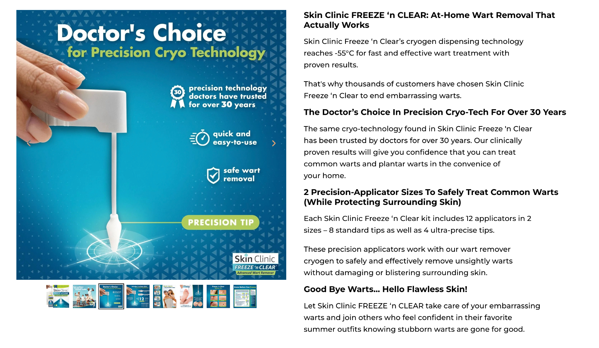
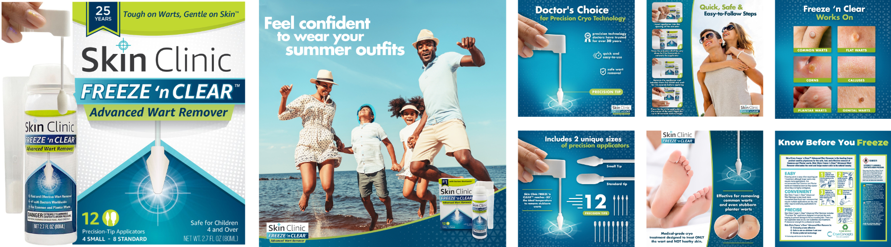
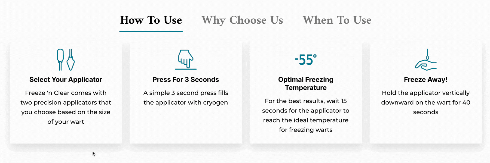
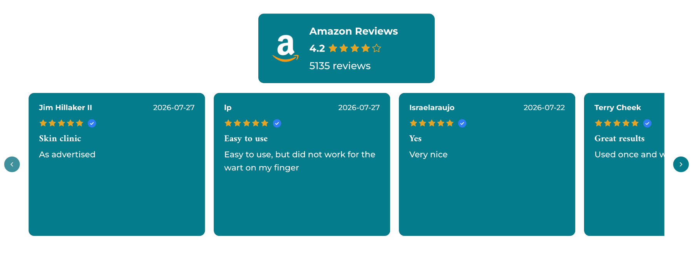
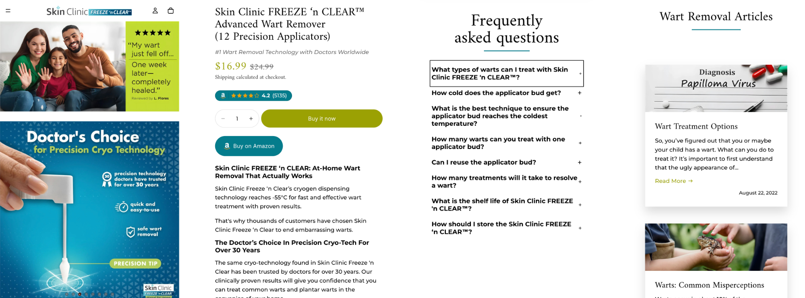
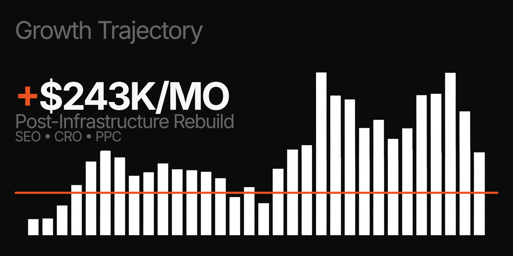

# Cryo Concepts

## From Professional Channel to High-Converting DTC Shopify Experience

**A conversion-focused Shopify launch built to translate clinical credibility into consumer confidence for an emerging at-home cryotherapy category.**

### Live Shopify Archive

**Store:** https://skin-clinic-freeze-n-clear-wart-remover-i0giwmdw.myshopify.com/  
**Password:** `thubab`

> This Shopify experience was created to spearhead Cryo Concepts' direct-to-consumer ecommerce efforts. We maintain a preserved version in a demo environment so the original strategy, design, and implementation can still be reviewed.

| | |
|---|---|
| **Platform** | Shopify |
| **Category** | Health & Beauty / Premium CPG |
| **Focus** | Trust, education, premium positioning & conversion architecture |
| **Primary Challenge** | Launching an unfamiliar medical-adjacent product directly to consumers |
| **Result** | **$68,000 in the first 28 days** |

---

# The Opportunity

Cryo Concepts had historically sold through medical offices and professional channels rather than directly to consumers.

That distinction mattered.

In a professional setting, the product could rely on medical-office context to help explain how it worked, establish credibility, answer questions, and reassure the customer.

Moving into DTC meant the ecommerce experience had to perform those jobs itself.

Cryo Concepts was bringing an at-home cryo-freezing solution for warts and skin tags into a relatively new consumer product category.

For many shoppers, both the technology and the idea of performing the treatment themselves were unfamiliar.

The Shopify experience therefore needed to answer several questions quickly:

**What is this?**

**Why should I trust it?**

**Will it work?**

**Can I really do this myself?**

The goal was to translate the confidence normally created in a professional environment into a consumer buying experience.

---

# Trust Had to Start Immediately

For a premium, medical-adjacent product, credibility couldn't wait until the bottom of the page.

The opening experience was designed to introduce reassurance immediately.

Five-star review proof was integrated directly into the hero so customers encountered validation at the same moment they were introduced to the product.

The principle was simple:

**Don't ask a skeptical customer to process the entire sales argument before giving them a reason to trust you.**

---

# Emotion + Education

The product couldn't be sold through technical explanation alone.

Consumers were ultimately buying a desired outcome:

## Feeling confident in their skin again.

The visual sales journey therefore combined emotional motivation with straightforward product education.

Rather than forcing shoppers to choose between lifestyle marketing and clinical information, the image stack was designed to do both.

### Emotional Drivers

Creative focused on outcomes such as:

- Feeling confident in your skin
- Removing unwanted visible blemishes
- Reducing embarrassment or self-consciousness
- Regaining control over a frustrating problem

### Product Understanding

Those emotional messages were paired with easy-to-understand visuals explaining the cryo-freezing technology and how the product was used.

### Credibility

The presentation also reinforced the established professional history of cryotherapy technology, helping connect an unfamiliar consumer product to a treatment concept shoppers could view as credible.

---

# Make the Technology Understandable

Cryotherapy may feel familiar in a medical office.

At-home cryotherapy was a much newer idea for the consumer.

The experience therefore needed to make the technology understandable without overwhelming shoppers with technical detail.

The objective wasn't to turn customers into experts.

It was to give them enough information to feel:

**"I understand what this does."**

and

**"I understand why this can work."**

To support that, we created a custom interactive education module designed to break a more complex product story into smaller, easy-to-process pieces.

The module features **three selectable headers**, each revealing its own three-tile content set.

Each tile can include:

- Custom iconography
- Focused educational copy
- Individual product or benefit messaging
- Interactive hover states

On desktop, hovering over a tile animates a colorful gradient across the background while dynamically switching between light and dark icon treatments to maintain contrast.

The interaction gives customers a visually engaging way to explore the technology and benefits without confronting them with a large wall of technical information.

**Complex information was still available—but the customer controlled how much of it they consumed at once.**

---

# Translate Clinical Credibility Into At-Home Confidence

One of the largest psychological barriers wasn't simply efficacy.

It was whether customers believed they could confidently perform the treatment themselves.

The page therefore addressed the friction of a traditional doctor visit while positioning Cryo Concepts as an approachable at-home alternative.

The message wasn't about dismissing professional care.

It was about helping the appropriate customer understand that this product was designed to make a traditionally clinical-feeling process:

**Quick · Approachable · Convenient · Easy to use at home**

The objective was to replace intimidation with confidence.

---

# Progressive Confidence-Building

The page wasn't designed as a collection of unrelated marketing sections.

The buying experience was structured so confidence increased as the customer moved through it.

The conversion sequence followed a progression of:

**Hero**

↓

**Education**

↓

**Benefits**

↓

**Proof**

↓

**Lifestyle / Emotional Outcome**

↓

**Comparison**

↓

**Guarantee / Reassurance**

↓

**FAQ / Objection Handling**

↓

**CTA**

At each stage, the customer should have fewer unanswered questions than they had before.

The objective wasn't simply to add more information.

**It was to progressively reduce uncertainty.**

---

# Marketplace Proof Inside Shopify

Because the category required substantial reassurance, existing customer proof became an important part of the DTC experience.

We integrated our Amazon Review Porting System to bring existing marketplace review content into Shopify and allow customer experiences to support the buying journey directly.

Rather than treating reviews as an isolated widget, social proof became part of the broader trust architecture.

### Technical Repository

[**View the Custom Amazon Review Porting System →**](https://github.com/JacobEcom/shopify-amazon-review-porting-system)

---

# Premium Without Becoming Intimidating

The product needed to maintain the credibility expected of a medical-adjacent solution without making the customer feel as though they were reading clinical documentation.

The visual system balanced:

**Professional credibility**

with

**Consumer accessibility**

The experience needed to feel premium enough to support the positioning while remaining approachable enough for someone considering an unfamiliar at-home treatment for the first time.

---

# Designed With Mobile in Mind

The trust and education sequence needed to remain intact on mobile.

Customers still needed to understand the product, encounter credibility, process the benefits, and feel capable of using it themselves—without the experience becoming dense or difficult to navigate on a smaller screen.

---

# Project Scope

### Strategy & CRO

DTC launch strategy · Conversion architecture · Buyer education · Trust development · Product positioning · Objection handling · Purchase-confidence strategy · Sales copy

### Creative

Creative direction · Hero design · Product image-stack strategy · Emotional positioning · Product education · Social-proof presentation · Consumer-friendly technical communication

### Shopify

Shopify storefront implementation · Theme customization · Product-page experience · Amazon review integration · Responsive implementation

---

# Ecommerce Results

This wasn't simply a design exercise.

The Shopify experience was created to help spearhead Cryo Concepts' move into direct-to-consumer ecommerce.

# $68,000 in the First 28 Days

The launch demonstrated that a product previously sold primarily through professional channels could be successfully translated into a consumer buying experience.

The conversion architecture focused on four things throughout the journey:

**Understanding**

**Trust**

**Credibility**

**Purchase Confidence**

That foundation established the brand's initial DTC growth trajectory while maintaining its premium positioning.

---

# Project Status

This Shopify experience was developed to help spearhead Cryo Concepts' move into direct-to-consumer ecommerce.

The production environment has evolved since the original engagement, so Ecom Optimization maintains a preserved Shopify version for portfolio and archival purposes.

The demo reflects the strategy, creative, conversion architecture, and Shopify experience developed during our engagement.

---

# Technical Stack

**Platform:** Shopify  
**Base Theme:** `Horizon`  
**Frontend:** Liquid · HTML · CSS · JavaScript
**Theme Work:** Shopify theme customization · Responsive implementation  
**Integration:** Custom Amazon Review Porting System

---

# Featured Implementation

### Amazon Review Integration

[**View the Custom Amazon Review Porting System →**](https://github.com/JacobEcom/shopify-amazon-review-porting-system)

---

# About Ecom Optimization

**Ecom Optimization combines conversion strategy, buyer psychology, creative, and Shopify development to build ecommerce experiences designed around how customers actually make purchase decisions.**

Development determines what an ecommerce experience *can* do.

Conversion strategy determines whether customers care.

[**Book a call with Sean to see how we can grow your Shopify together →**](https://api.leadconnectorhq.com/widget/otl/REF4zhgVC?slug=sean-farrington76t4ol)

---

## Explore the Archived Build

**Shopify Preview:**  
https://skin-clinic-freeze-n-clear-wart-remover-i0giwmdw.myshopify.com/

**Password:** `thubab`
